# TD3-JAX
A JAX Implementation of the [Twin Delayed DDPG](https://github.com/sfujim/TD3) Algorithm


## Requirements

Beside each requirement, I have stated the version installed on my system for reproducibility..

* [JAX](https://github.com/google/jax) - jax 0.1.59, jaxlib 0.1.39
* [Haiku](https://github.com/deepmind/dm-haiku) - dm-haiku 0.0.1a0, dm-sonnet 2.0.0b0
* [RLax](https://github.com/deepmind/rlax) - rlax 0.0.0
* [Gym](https://github.com/openai/gym) - gym 0.15.4
* [MuJoCo](https://github.com/openai/mujoco-py) - mujoco-py 2.0.2.9

## Command line arguments
In order to run each environment
```
for seed in {0..9}; do python main.py --env Hopper-v2 --seed $seed; done
```

The default hyper parameters aren't ideal for all domains.
Based on some limited testing and intuition, the following values are better than the defaults.

Environment | Command line addition
--- | ---
Swimmer-v2 | --discount 0.995

## Results

For each seed, we maintain the 'best policy seen' during evaluation, which we re-evaluate at the end of training.
These results are the average +\- one standard deviation for this metric.
All reported results are based on 10 seeds (0 to 9).

Environment | Best policy per run
--- | ---
Hopper-v2 | 3691.5 ± 61.7
Humanoid-v2 | 5194.0 ± 97.1
Walker2d-v2 | 4328.8 ± 1059.0
Ant-v2 | 3505.4 ± 411.7
HalfCheetah-v2 | 10411.0 ± 1323.5
Swimmer-v2 | 314.1 ± 69.2
InvertedPendulum-v2 | 1000.0 ± 0.0
InvertedDoublePendulum-v2 | 9350.6 ± 26.8
Reacher-v2 | -4.0 ± 0.3


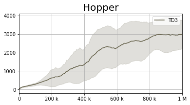
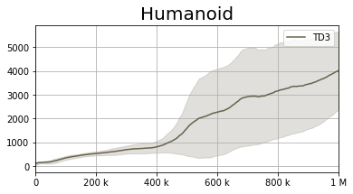
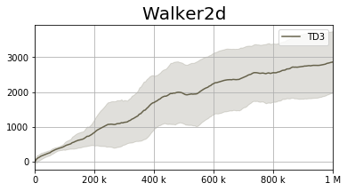
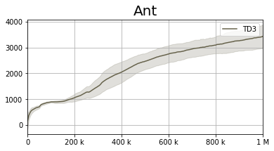
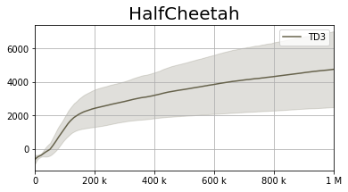

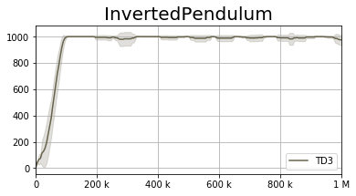
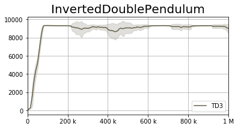
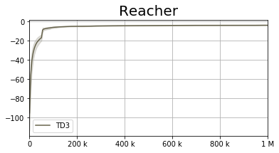

The code for reproducing the figures, including per-seed representation for each environment is provided in [plot_results.ipynb](plot_results.ipynb)

Based on the per-seed analysis, it seems that with some hyperparameter tuning, the results of TD3 can improve dramatically.
Mainly, it seems that in some domains, it takes a while for the algorithm to start learning -- either a result of low learning rates, large experience replay or un-optimized discount factor.

For instance:

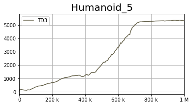

versus

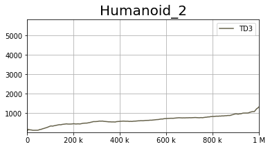

and

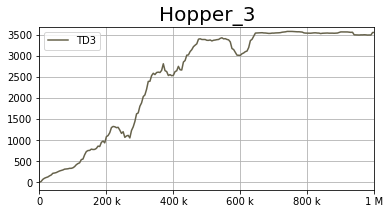

versus

